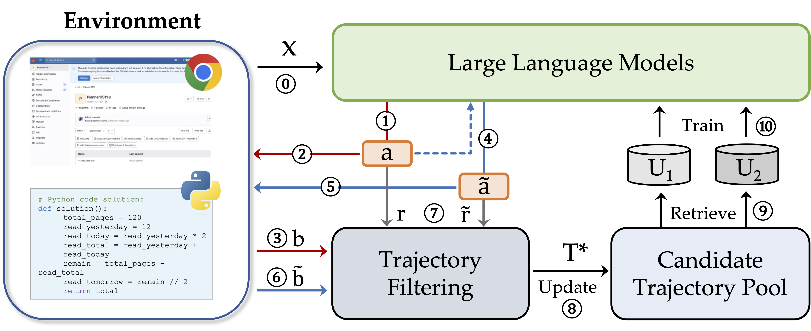

<h1 align="center">
<!--  -->
<br>
Interactive Evolution: A Neural-Symbolic Self-Training Framework for Large Language Models
</h1>


<p align="center">
  <a href="https://xufangzhi.github.io/symbol-llm-page/"><b>[🌐 Website]</b></a> •
  <a href="http://arxiv.org/abs/2406.11736"><b>[📜 Paper]</b></a> •
  <a href="https://huggingface.co/Symbol-LLM/ENVISIONS_7B_math_iter10"><b>[🤗 HF Models]</b></a> •
  <a href="https://github.com/xufangzhi/ENVISIONS"><b>[🐱 GitHub]</b></a>
  
</p>


<p align="center">
Repo for "<a href="http://arxiv.org/abs/2406.11736" target="_blank">Interactive Evolution: A Neural-Symbolic Self-Training Framework for Large Language Models</a>"
</p>


## 🔥 News
- [2024/07/12] 🚀 The codebase is fixed and completed ! Try it in Branch v0.2 !
- [2024/07/09] A series of [checkpoints](https://huggingface.co/Symbol-LLM/) after self-training with ENVISIONS are released at huggingface ! Cover agent, math and logic domains ! Include 7B and 13B versions ! Check it out !
- [2024/05/20] 🚀🚀🚀 ENVISIONS is under review!
- [2024/05/01] 🔥🔥🔥 We create a new repo for the code of ENVISIONS!


## 📒 Note
This work is still in progress. You can also check our previous work [Symbol-LLM](https://arxiv.org/abs/2311.09278) on neural-symbolism. It will appear at ACL 2024 main conference.

## 🌍 ENVISIONS: **ENV**-gu**I**ded **S**elf-tra**I**ning framework f**O**r **N**eural **S**ymbolic scenarios




## 🔧 Environments
Please refer to ``requirements.txt`` to build the environment.

## 🚀 How to Start Training

To try on ENVISIONS, please use the bash script `run_self_training.sh` or directly use the following command:

For **agentic** task MiniWob, please use:
```bash
python ENVISIONS/self_training_miniwob.py --base_model "llama2chat" --model_size "7B" --task_prefix "miniwob_llama2chat" --vllm_batchsize 1
```

For **mathematical** tasks, please use:
```bash
python ENVISIONS/self_training.py --base_model "llama2chat" --model_size "7B" --task_prefix "gsm_math_full_llama2chat" --vllm_batchsize 1
```

For **logical reasoning** tasks, please use:
```bash
python ENVISIONS/self_training_logic.py --base_model "llama2chat" --model_size "7B" --task_prefix "logic_llama2chat" --vllm_batchsize 1
```

*Note: paths to the base LLM are required to be replaced with your local path of the corresponding checkpoints.


## 🌐 Acknowledgements
+ The LLM training is based on [open-instruct](https://github.com/allenai/open-instruct) and the generation steps are accelerated by [vLLM](https://github.com/vllm-project/vllm).
+ The environments are modified from [Synapse](https://github.com/ltzheng/Synapse) and [SeeClick](https://github.com/njucckevin/SeeClick) for agentic tasks, [PAL](https://github.com/reasoning-machines/pal) for mathemetical tasks, and [Logic-LM](https://github.com/teacherpeterpan/Logic-LLM) for logical reasoning tasks.


## Citation
If you find it helpful, please kindly cite our paper.
```
@misc{xu2024interactive,
      title={Interactive Evolution: A Neural-Symbolic Self-Training Framework For Large Language Models}, 
      author={Fangzhi Xu and Qiushi Sun and Kanzhi Cheng and Jun Liu and Yu Qiao and Zhiyong Wu},
      year={2024},
      eprint={2406.11736},
      archivePrefix={arXiv},
}
```
